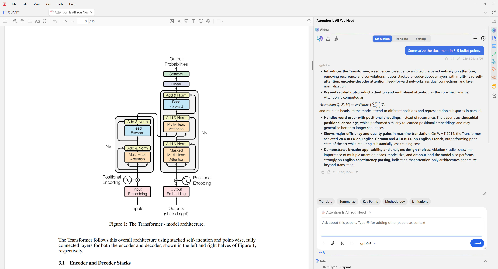
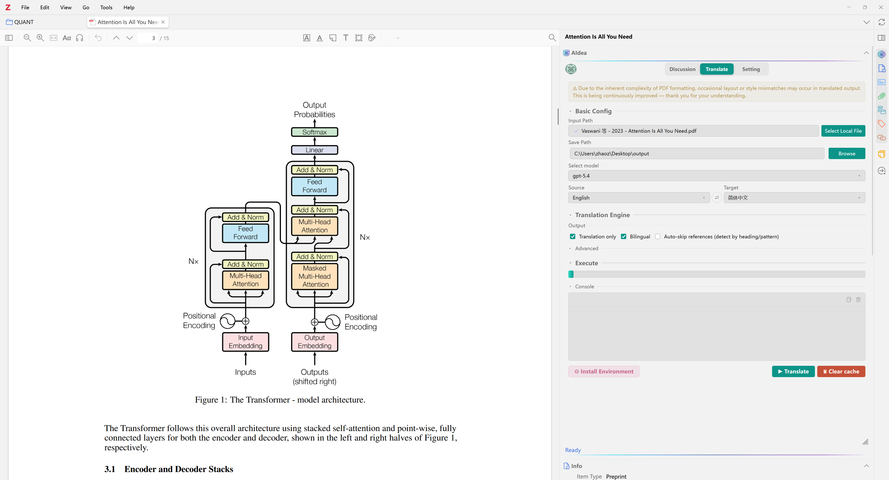
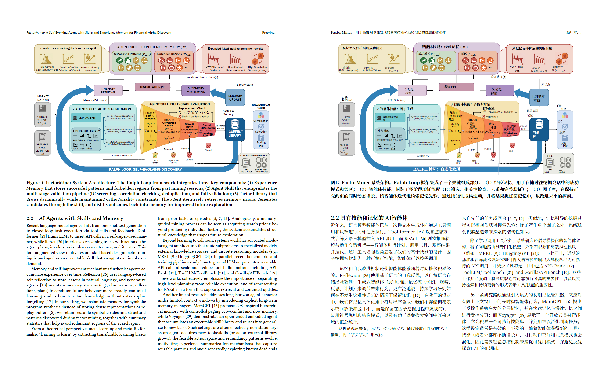
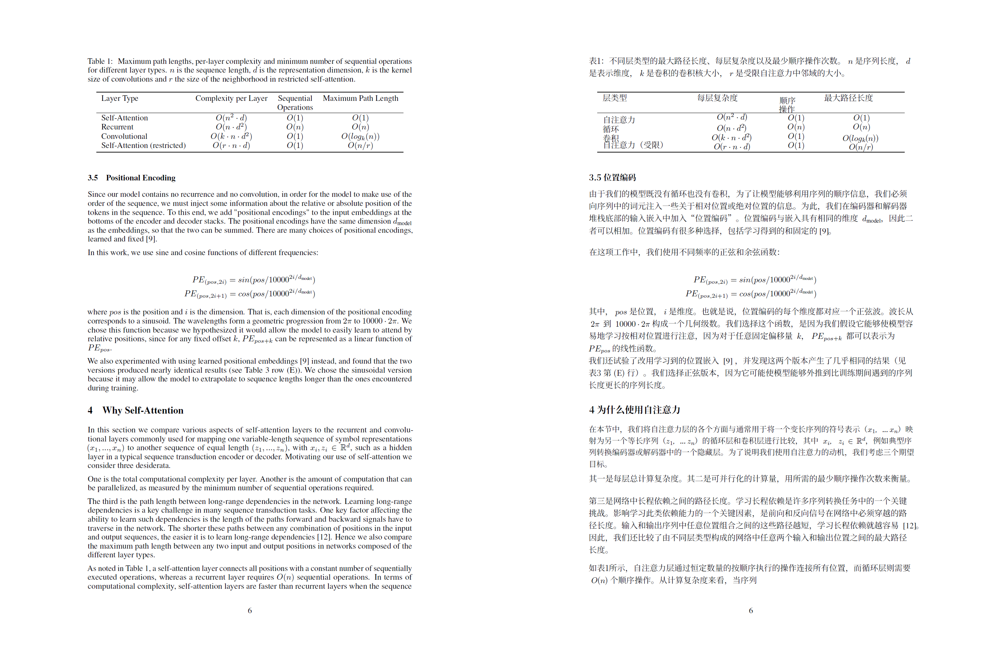
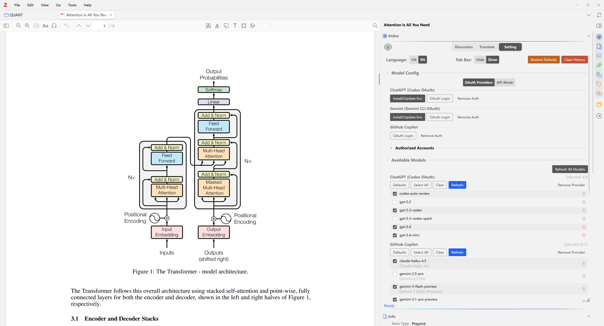
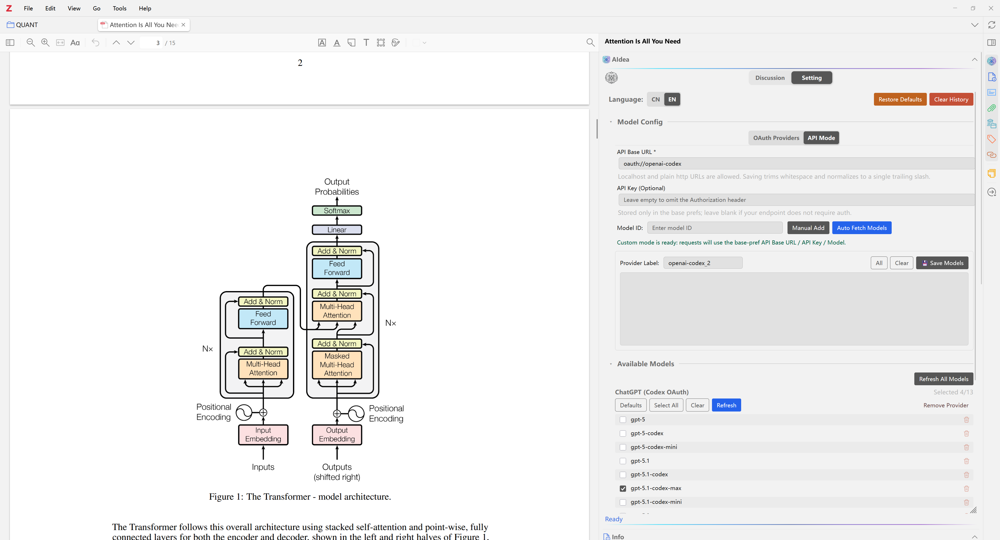

> [中文文档](README_CN.md) | English Version

<p align="center">
  
</p>

<h1 align="center">AIdea</h1>

<p align="center">
  <strong>A free, open-source AI assistant plugin for Zotero</strong><br/>
  OAuth login with your existing account, or connect any OpenAI-compatible endpoint
</p>

<p align="center">
  🎉🎊 <strong>Now supporting ChatGPT 5.4!</strong> 🚀✨
</p>

<p align="center">
  🟢 <strong>OpenAI (ChatGPT)</strong><br/>
  🔵 <strong>Google Gemini</strong><br/>
  🟣 <strong>Qwen (通义千问)</strong><br/>
  ⚫ <strong>GitHub Copilot</strong>
</p>

<p align="center">
  <a href="./README_CN.md">中文版</a> &nbsp;|&nbsp;
  <a href="#-features">Features</a> &nbsp;|&nbsp;
  <a href="#-installation">Installation</a> &nbsp;|&nbsp;
  <a href="#-getting-started">Getting Started</a> &nbsp;|&nbsp;
  <a href="#-license">License</a>
</p>

---

## ✨ Features

### 💬 AI Chat in Side Panel

Chat with AI directly in Zotero's side panel — available in both the **Library** view and the **PDF Reader**. Ask questions, get summaries, and interact with your research seamlessly.

<p align="center">
  
</p>

### 📄 Paper-Aware Context

Select text in the PDF reader and click **"Add Text"** to attach the selected passage to the context area. The AI will use it as reference when answering your questions — enabling precise, passage-level Q&A.

### ⚡ Quick Action Shortcuts

One-click shortcut buttons for common tasks like **Summarize**, **Explain**, **Translate**, and more. Fully customizable — add, edit, reorder, or remove shortcuts to fit your workflow.

### 🖼️ Multimodal Support

Attach images (screenshots, figures, charts) to your messages. Drag & drop, paste from clipboard, or use the screenshot tool to capture content directly from your PDFs.

### 🔐 OAuth Account Login (No API Key Required)

Sign in with your **existing account** via OAuth — no need for an API key or subscription. Supports multiple providers with different OAuth flows for seamless authentication.

### Full-Document Translation

Translate entire papers directly inside Zotero and export either a **bilingual dual-column PDF** or a **Chinese-only mono PDF**. The full-document translation tab now supports model selection, output path configuration, and end-to-end task execution inside the side panel.

<p align="center">
  
</p>

Example outputs:

<p align="center">
  
</p>

<p align="center">
  
</p>

<p align="center">
  
</p>

> **Latest supported version: ChatGPT 5.4**

### 🌐 Multi-Provider Support

| Provider             | Auth Method                   | Extra Setup              |
| -------------------- | ----------------------------- | ------------------------ |
| **OpenAI (ChatGPT)** | OAuth via Codex CLI           | Node.js (auto-installed) |
| **Google Gemini**    | In-plugin OAuth (PKCE)        | Node.js (auto-installed) |
| **Qwen (通义千问)**  | In-plugin OAuth (Device Code) | None                     |
| **GitHub Copilot**   | In-plugin OAuth (Device Code) | None                     |

### 📝 Note Export

Save AI responses as Zotero notes with one click. Responses are formatted in Markdown with full LaTeX math rendering support.

### 💾 Persistent Chat History

All conversations are saved locally in Zotero's database. Switch between multiple conversations, continue where you left off, and manage your chat history.

### 🧠 Memory System

The AI automatically captures and recalls important information across conversations, enabling personalized, context-aware responses that improve over time.

- **Auto-Capture** — detects preferences, decisions, facts, and key entities from natural conversation
- **Per-Library Isolation** — memories are scoped to each Zotero library, keeping research projects separate
- **Smart Deduplication** — Jaccard token similarity (≥90%) prevents storing redundant memories
- **Relevance-Ranked Retrieval** — multi-factor scoring (token overlap × 0.65 + substring boost + recency × 0.15 + importance × 0.20)
- **Prompt Injection Defense** — built-in pattern detection prevents malicious content from being stored
- **Fully Local** — all memories are stored in Zotero's SQLite database; nothing is sent externally

### 🎨 Rich Rendering

- Full **Markdown** rendering (headings, lists, code blocks, tables)
- **LaTeX** math formula support (powered by KaTeX)
- **Syntax highlighting** for code blocks
- Smooth **streaming** responses

### 🌍 Bilingual Interface

Full support for **English** and **Chinese** (中文) — switch languages in Settings at any time.

---

## 📦 Installation

### Requirements

- **Zotero 7 or later** (version 7.0+)
- **Node.js** — required for OpenAI and Gemini; **auto-installed** by the plugin if missing (Qwen and GitHub Copilot do not require Node.js)

### Install the Plugin

1. Download the latest `AIdea-x.x.x.xpi` from [Releases](https://github.com/Visterainer/aidea-zotero/releases)
2. In Zotero, go to **Tools → Add-ons**
3. Click the gear icon ⚙️ → **Install Add-on From File...**
4. Select the downloaded `.xpi` file
5. Restart Zotero

### Upgrade

Simply install the new `.xpi` file — it will automatically replace the old version. **All your chat history and settings are preserved.**

---

## 🚀 Getting Started

### 1. Open Settings

Go to **Tools → Add-ons → AIdea → Settings** (or **Edit → Settings → AIdea** on older Zotero)

### 2. Set Up a Provider

AIdea offers two connection modes. You can use one or both:

#### Option A: OAuth Login (No API Key Required)

Sign in with your **existing account** — no API key needed. For each provider you want to use, the setup flow on the **provider card** is:

> **① `Install/Update Env`** → **② `OAuth Login`** → **③ `Refresh Models`**

| Button                   | What it does                                                                                                                                                                                                                                                                      |
| ------------------------ | --------------------------------------------------------------------------------------------------------------------------------------------------------------------------------------------------------------------------------------------------------------------------------- |
| **`Install/Update Env`** | Automatically installs and configures the required CLI tool and runtime (Node.js, npm, etc.). A risk notice appears on first run — read it and confirm to proceed. For **Qwen** and **GitHub Copilot**, this step is not needed.                                                  |
| **`OAuth Login`**        | Opens the OAuth authentication flow. For **OpenAI / Gemini**, your browser opens — sign in with your account. For **Qwen / GitHub Copilot**, a dialog shows your authorization code; click **OK** to copy it and open the browser, then paste the code to complete authorization. |
| **`Refresh Models`**     | After login, click this to load the list of available models for this provider.                                                                                                                                                                                                   |
| **`Remove Auth`**        | Clears the saved OAuth token for this provider.                                                                                                                                                                                                                                   |

<p align="center">
  
</p>

> 💡 **Tip:** You only need to do this once per provider. The login session is saved locally and persists across Zotero restarts.

#### Option B: Custom OpenAI-Compatible Endpoint

As an alternative to OAuth, AIdea supports connecting to any **OpenAI-compatible chat endpoint**. This is useful for users who want to use local or self-hosted models (e.g. Ollama, LM Studio, vLLM), or third-party services (e.g. DeepSeek, OpenRouter, Groq).

In **Settings**, switch to the **API Mode** tab and fill in the following fields:

| Field            | Required | Description                                                                                                                                                      |
| ---------------- | -------- | ---------------------------------------------------------------------------------------------------------------------------------------------------------------- |
| **API Base URL** | Yes      | The base URL of your endpoint (e.g. `https://api.openai.com/v1` or a local address like `http://localhost:11434/v1`). Local and self-hosted endpoints are supported. |
| **API Key**      | No       | An API key if your endpoint requires authentication. Leave blank if no key is needed.                                                                            |
| **Model**        | Yes      | Enter a model ID manually, or click **Auto Fetch Models** to discover available models automatically.                                                            |

<p align="center">
  
</p>

> **Note:** This feature targets OpenAI-compatible `/chat/completions` endpoints. It does not guarantee compatibility with provider-specific features such as tool calling, file uploads, or image inputs beyond basic chat completion.

#### Available Models

Both connection modes share a unified model list. You can select which models to use, manage per-provider models, and refresh them at any time.

<p align="center">
  
</p>

### 3. Start Chatting

- **Library Panel**: Select any item in your library — the AIdea panel appears in the right sidebar
- **PDF Reader**: Open any PDF — the AIdea panel appears in the reader's side panel
- Type your question and press **Send** or hit `Enter`

### 4. Use Quick Actions

Click any shortcut button (**Summarize**, **Explain**, **Translate**, etc.) for one-click actions. Right-click a shortcut to edit or remove it.

---

## ⚙️ Configuration

| Setting             | Description                                            | Default                      |
| ------------------- | ------------------------------------------------------ | ---------------------------- |
| **UI Language**     | Interface language (EN / CN)                           | EN                           |
| **System Prompt**   | Custom instructions for the AI                         | Empty (use built-in default) |
| **Show "Add Text"** | Show the Add Text option in the reader selection popup | ☑ On                         |
| **Show All Models** | Show all available models vs. curated best models only | ☐ Off                        |

---

## 🔒 Privacy & Security

- 🔑 OAuth tokens are stored **locally only** — never sent to third-party servers
- 📡 All API communication is **directly between you and the AI provider**
- 🚫 This plugin **does not collect any user data**
- 📖 Fully **open-source** — inspect the code anytime at [GitHub](https://github.com/Visterainer/aidea-zotero)

---

## 🗺️ Roadmap

Planned features for upcoming releases:

- 🔤 **Highlight Translation** — Select text in the PDF reader to instantly translate highlighted passages in place
- 🗂️ **One-Click Architecture Diagram** — Automatically generate a structural diagram from the paper's content, visualizing the research framework at a glance

> 💡 Have a feature request? Feel free to open an [Issue](https://github.com/Visterainer/aidea-zotero/issues)!

---

## 🛠️ Development

```bash
# Install dependencies
npm install

# Development mode (with hot reload)
npm start

# Build production XPI
npm run build

# Run tests
npm run test:unit
```

---

## 📄 License

[AGPL-3.0-or-later](./LICENSE)

This project is a fork of [llm-for-zotero](https://github.com/yilewang/llm-for-zotero) by Yile Wang. See [THIRD_PARTY_NOTICES.md](./THIRD_PARTY_NOTICES.md) for full attribution.

---

## ⭐ Star History

<a href="https://star-history.com/#Visterainer/aidea-zotero&Date">
 <picture>
   <source media="(prefers-color-scheme: dark)" srcset="https://api.star-history.com/svg?repos=Visterainer/aidea-zotero&type=Date&theme=dark" />
   <source media="(prefers-color-scheme: light)" srcset="https://api.star-history.com/svg?repos=Visterainer/aidea-zotero&type=Date" />
   
 </picture>
</a>

---

<p align="center">
  Author: <strong>zhile</strong>
</p>
