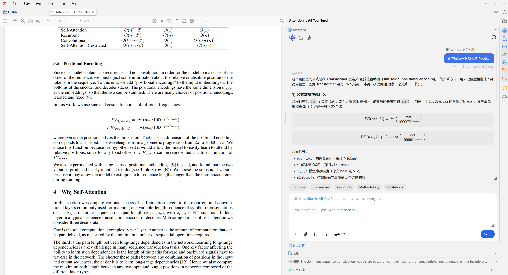
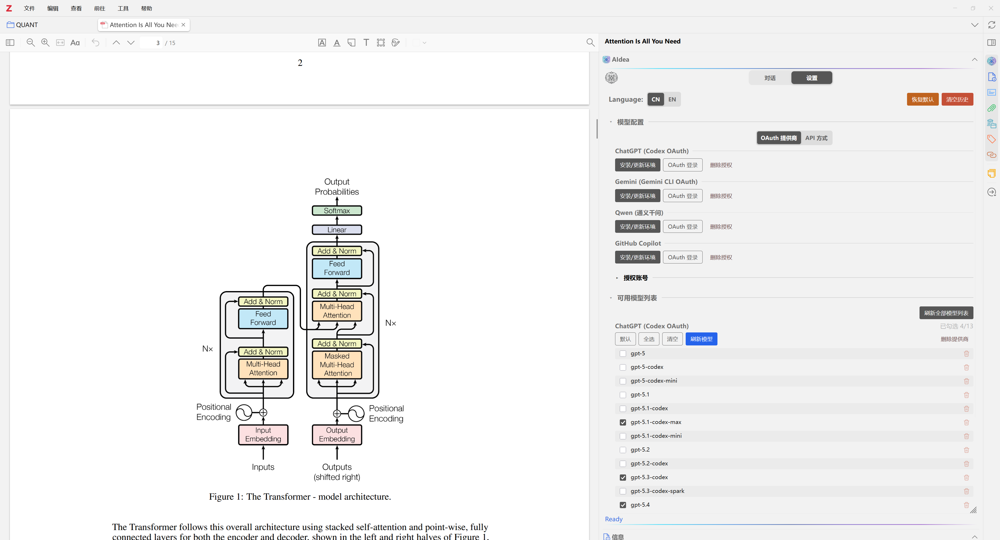
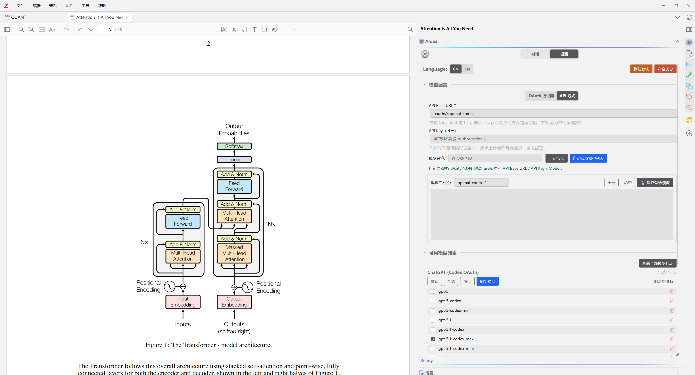
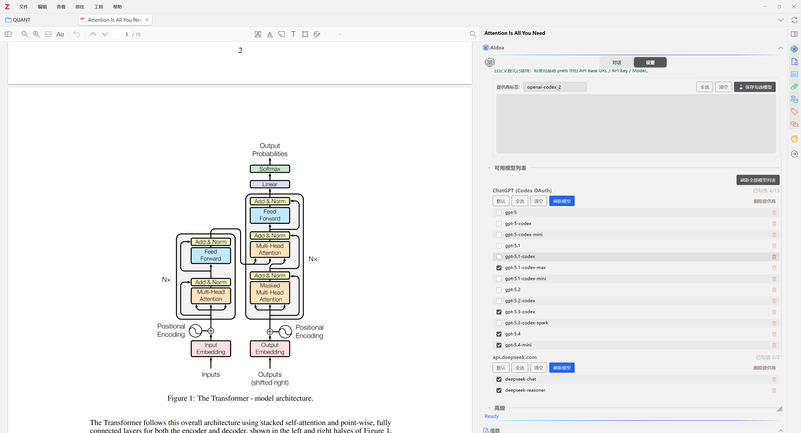

<p align="center">
  
</p>

<h1 align="center">AIdea</h1>

<p align="center">
  <strong>免费开源的 Zotero AI 助手插件</strong><br/>
  OAuth 账号直接登录，同时支持 API 接入与本地模型
</p>

<p align="center">
  🎉🎊 <strong>现已支持最新 ChatGPT 5.4！</strong> 🚀✨
</p>

<p align="center">
  🟢 <strong>OpenAI (ChatGPT)</strong><br/>
  🔵 <strong>Google Gemini</strong><br/>
  🟣 <strong>Qwen (通义千问)</strong><br/>
  ⚫ <strong>GitHub Copilot</strong>
</p>

<p align="center">
  <a href="./README.md">English</a> &nbsp;|&nbsp;
  <a href="#-功能特性">功能特性</a> &nbsp;|&nbsp;
  <a href="#-安装">安装</a> &nbsp;|&nbsp;
  <a href="#-快速开始">快速开始</a> &nbsp;|&nbsp;
  <a href="#-许可证">许可证</a>
</p>

---

## ✨ 功能特性

### 💬 侧边栏 AI 对话

在 Zotero 的侧边栏中直接与 AI 对话 —— **文库视图**和 **PDF 阅读器**中均可使用。提问、获取摘要，与你的研究资料无缝交互。

<p align="center">
  
</p>

### 📄 论文感知上下文

在 PDF 阅读器中选中文本，点击 **"Add Text"** 即可将选中内容添加到上下文区域。AI 在回答时会自动引用这些内容作为参考，实现段落级的精准问答。

### ⚡ 快捷操作按钮

一键触发常用任务：**总结**、**解释**、**翻译**等。完全可自定义 —— 添加、编辑、排序或删除快捷按钮，打造属于你的工作流。

### 🖼️ 多模态支持

在消息中附加图片（截图、图表、示意图）。支持拖拽、从剪贴板粘贴，或使用截图工具直接从 PDF 中捕获内容。

### 🔐 OAuth 账号登录（无需 API Key）

使用你的**已有账号**通过 OAuth 登录 —— 无需 API Key，也不需要 API 平台的独立订阅。插件支持多个服务商，采用不同的 OAuth 流程实现无缝认证。

> **最新支持版本：ChatGPT 5.4**

### 🌐 多服务商支持

| 服务商               | 认证方式                    | 额外安装                |
| -------------------- | --------------------------- | ----------------------- |
| **OpenAI (ChatGPT)** | Codex CLI OAuth             | Node.js（插件自动安装） |
| **Google Gemini**    | 插件内 OAuth（PKCE）        | Node.js（插件自动安装） |
| **Qwen（通义千问）** | 插件内 OAuth（Device Code） | 无需额外安装            |
| **GitHub Copilot**   | 插件内 OAuth（Device Code） | 无需额外安装            |

### 📝 笔记导出

一键将 AI 回复保存为 Zotero 笔记。回复以 Markdown 格式保存，完整支持 LaTeX 数学公式渲染。

### 💾 持久化聊天记录

所有对话保存在 Zotero 的本地数据库中。可在多个对话之间切换，随时继续之前的讨论，自由管理聊天历史。

### 🧠 记忆系统

AI 自动捕捉并回忆跨对话的重要信息，提供个性化、上下文感知的回复，且随着使用越来越智能。

- **自动捕捉** —— 从自然对话中检测用户偏好、决策、事实和关键实体
- **按文库隔离** —— 记忆以 Zotero 文库为单位存储，不同研究项目的记忆彼此独立
- **智能去重** —— 使用 Jaccard 词元相似度（≥90% 阈值）防止存储重复记忆
- **相关性排序检索** —— 多因子综合评分（词元重叠 × 0.65 + 子串包含 + 时间衰减 × 0.15 + 重要性 × 0.20）
- **提示注入防护** —— 内置模式检测，防止恶意内容被存入记忆
- **完全本地** —— 所有记忆存储在 Zotero 的 SQLite 数据库中，不会发送到任何外部服务器

### 🎨 丰富的渲染效果

- 完整的 **Markdown** 渲染（标题、列表、代码块、表格）
- **LaTeX** 数学公式支持（由 KaTeX 驱动）
- 代码块**语法高亮**
- 流畅的**流式输出**体验

### 🌍 双语界面

完整支持**英文**和**中文** —— 可在设置中随时切换语言。

---

## 📦 安装

### 环境要求

- **Zotero 7 及以上**（7.0+ 版本）
- **Node.js** —— OpenAI 和 Gemini 所需；**插件可自动安装**，无需手动操作（通义千问和 GitHub Copilot 无需 Node.js）

### 安装插件

1. 从 [Releases](https://github.com/Visterainer/aidea-zotero/releases) 下载最新的 `AIdea-x.x.x.xpi`
2. 在 Zotero 中，进入 **工具 → 附加组件**
3. 点击齿轮图标 ⚙️ → **从文件安装附加组件...**
4. 选择下载的 `.xpi` 文件
5. 重启 Zotero

### 升级

直接安装新版 `.xpi` 文件即可自动覆盖旧版本。**所有聊天记录和设置均会保留。**

---

## 🚀 快速开始

### 1. 打开设置

进入 **工具 → 附加组件 → AIdea → 设置**（或 **编辑 → 首选项 → AIdea**）

### 2. 配置服务商

AIdea 提供两种连接方式，你可以选择其中一种或同时使用：

#### 方式一：OAuth 登录（无需 API Key）

使用你的**现有账号**直接登录，无需申请 API Key。在每个服务商的卡片上，按以下顺序点击按钮完成配置：

> **① `安装/更新环境`** → **② `OAuth 登录`** → **③ `刷新模型`**

| 按钮                | 功能说明                                                                                                                                                                                                |
| ------------------- | ------------------------------------------------------------------------------------------------------------------------------------------------------------------------------------------------------- |
| **`安装/更新环境`** | 自动安装并配置所需的 CLI 工具及运行环境（Node.js、npm 等）。首次运行时会弹出风险提示 —— 请仔细阅读后确认继续。**通义千问**和 **GitHub Copilot** 无需此步骤。                                            |
| **`OAuth 登录`**    | 启动 OAuth 授权流程。**OpenAI / Gemini**：浏览器将自动打开，使用你的账号登录即可。**通义千问 / GitHub Copilot**：弹窗会显示授权码，点击**确定**自动复制授权码并打开浏览器，在页面中粘贴授权码完成授权。 |
| **`刷新模型`**      | 登录成功后点击此按钮，加载该服务商下的可用模型列表。                                                                                                                                                    |
| **`删除授权`**      | 清除该服务商已保存的 OAuth 令牌。                                                                                                                                                                       |

<p align="center">
  
</p>

> 💡 **提示：** 每个服务商只需配置一次。登录状态保存在本地，重启 Zotero 后依然有效。

#### 方式二：自定义 OpenAI 兼容端点

除了 OAuth 登录外，AIdea 还支持连接任意 **OpenAI 兼容聊天端点**。适合使用本地或自托管模型（如 Ollama、LM Studio、vLLM），或第三方服务（如 DeepSeek、OpenRouter、Groq）的用户。

在 **设置** 中切换到 **API Mode** 页签，填写以下字段：

| 字段             | 必填 | 说明                                                                                                             |
| ---------------- | ---- | ---------------------------------------------------------------------------------------------------------------- |
| **API Base URL** | 是   | 端点的基地址（例如 `https://api.openai.com/v1`，或本地地址如 `http://localhost:11434/v1`）。支持本地及自托管端点。 |
| **API Key**      | 否   | 如果端点需要认证则填写 API Key；如无需认证可留空。                                                               |
| **Model**        | 是   | 手动输入模型 ID，或点击**自动获取模型**按钮自动发现可用模型。                                                    |

<p align="center">
  
</p>

> **注意：** 此功能面向 OpenAI 兼容的 `/chat/completions` 端点，不保证对工具调用、文件上传或图片输入等服务商特定功能的兼容性。

#### 可用模型

两种连接方式共享统一的模型列表。你可以选择要使用的模型、按服务商管理模型，并随时刷新。

<p align="center">
  
</p>

### 3. 开始对话

- **文库面板**：在文库中选择任意条目 —— 右侧边栏将出现 AIdea 面板
- **PDF 阅读器**：打开任意 PDF —— 阅读器侧边栏将出现 AIdea 面板
- 输入你的问题，点击**发送**或按 `Enter`

### 4. 使用快捷操作

点击快捷按钮（**总结**、**解释**、**翻译**等）即可一键执行常用操作。右键点击可编辑或删除快捷按钮。

---

## ⚙️ 配置选项

| 设置项              | 说明                                 | 默认值               |
| ------------------- | ------------------------------------ | -------------------- |
| **界面语言**        | 界面语言（EN / CN）                  | EN                   |
| **系统提示词**      | 自定义 AI 指令                       | 空（使用内置默认值） |
| **显示 "Add Text"** | 在阅读器选择弹窗中显示 Add Text 选项 | ☑ 开启               |
| **显示所有模型**    | 显示全部模型 vs. 精选最优模型        | ☐ 关闭               |

---

## 🔒 隐私与安全

- 🔑 OAuth 令牌**仅保存在本地** —— 绝不会发送至任何第三方服务器
- 📡 所有 API 通信**直接发生在你与 AI 服务商之间**
- 🚫 本插件**不收集任何用户数据**
- 📖 完全**开源** —— 随时可在 [GitHub](https://github.com/Visterainer/aidea-zotero) 查看源代码

---

## 🗺️ 未来计划

即将推出的功能：

- 🔤 **划词翻译** —— 在 PDF 阅读器中选中文本，即时翻译选中段落
- 📖 **一键翻译全文** —— 一键翻译整篇论文，生成双语对照视图
- 🗂️ **一键生成框架图** —— 自动从论文内容生成结构图，一目了然地展示研究框架

> 💡 有功能建议？欢迎提交 [Issue](https://github.com/Visterainer/aidea-zotero/issues)！

---

## 🛠️ 开发

```bash
# 安装依赖
npm install

# 开发模式（支持热重载）
npm start

# 构建生产版 XPI
npm run build

# 运行测试
npm run test:unit
```

---

## 📄 许可证

[AGPL-3.0-or-later](./LICENSE)

本项目 fork 自 [llm-for-zotero](https://github.com/yilewang/llm-for-zotero)（作者 Yile Wang）。完整的第三方声明请参阅 [THIRD_PARTY_NOTICES.md](./THIRD_PARTY_NOTICES.md)。

---

## ⭐ Star History

<a href="https://star-history.com/#Visterainer/aidea-zotero&Date">
 <picture>
   <source media="(prefers-color-scheme: dark)" srcset="https://api.star-history.com/svg?repos=Visterainer/aidea-zotero&type=Date&theme=dark" />
   <source media="(prefers-color-scheme: light)" srcset="https://api.star-history.com/svg?repos=Visterainer/aidea-zotero&type=Date" />
   
 </picture>
</a>

---

<p align="center">
  作者：<strong>zhile</strong>
</p>
